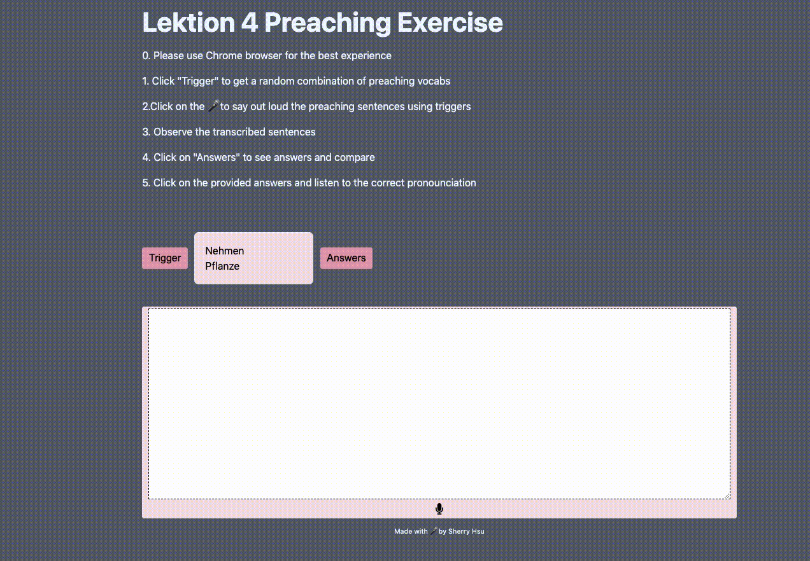

# Intro

This German Preaching App is bootstrapped with [`create-next-app`](https://github.com/vercel/next.js/tree/canary/packages/create-next-app).

This is to accompany the preaching exercises in the Lesson 4 of the [Smarter German Course](https://courses.smartergerman.com/p/learn-german-online-course-a1-b1-part-01-of-12-intro)

[Access the App!](https://german-preaching-app.vercel.app/)

## Motivation

In lesson 4, there are multiple combinations of verbs and objects we can select for preaching exercise. I want an app that can randomly generate a [verb, object] combination for me. It can also transcribe my speech so I get instant feedback for prounciation. I can also get to listen to the correct pronounciation easily.



## Technology

NextJS, TypeScript, CSS Modules

## Future Features

- Add more lessons
- Check for other browser support - FF, Edge
- Insert the text into the speechArea where the cursor is placed (like Speechnote.co)
- use a Reach UI modal instead of alert

## Development Environment

First, run the development server:

```bash
npm run dev
# or
yarn dev
```

Open [http://localhost:3000](http://localhost:3000) with your browser to see the result.
